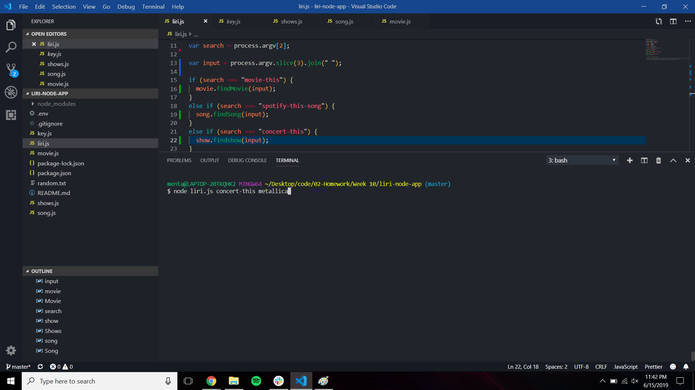
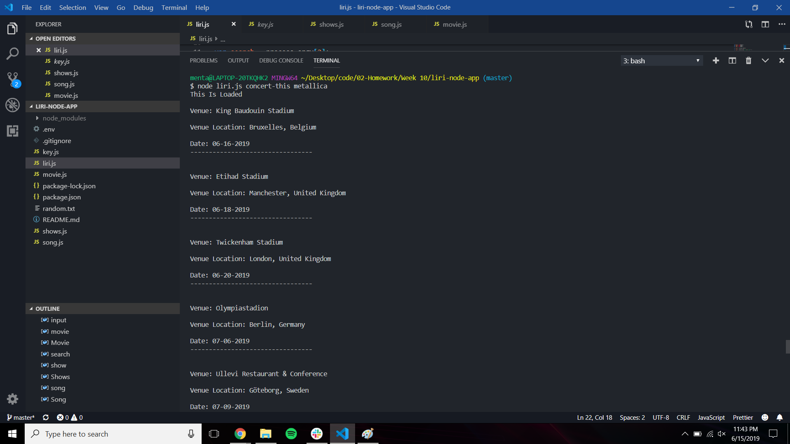
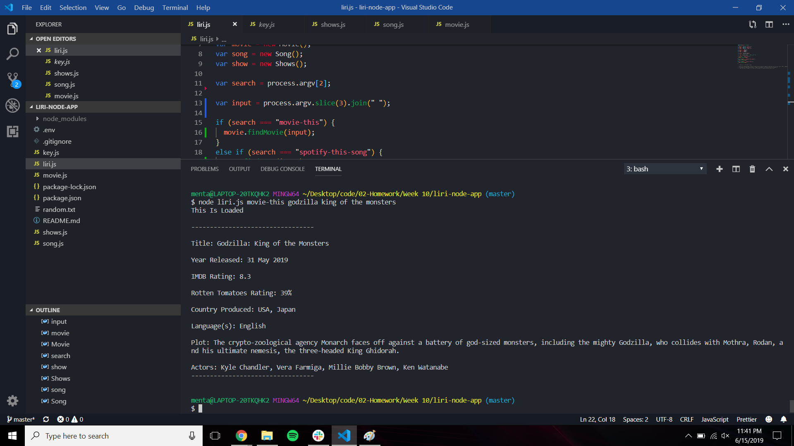
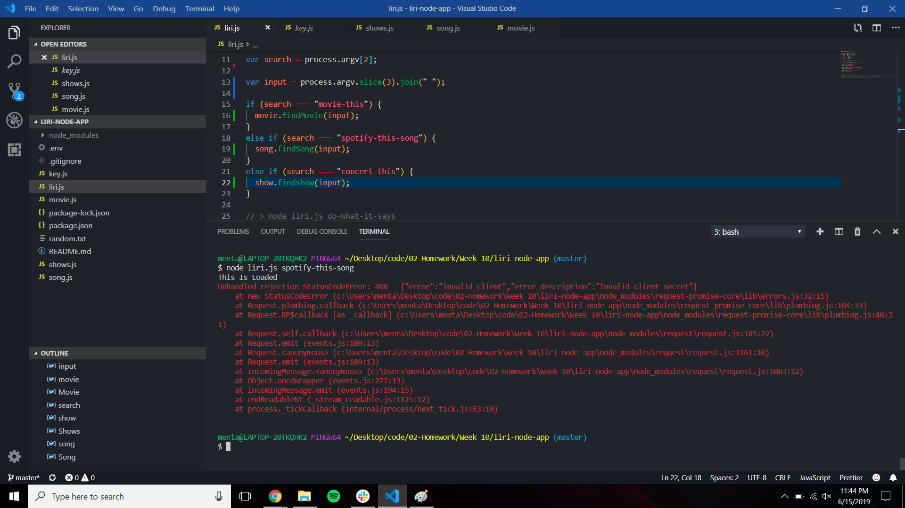

# liri-node-app

The purpose of this assignment is to create a search engine that is able to use APIs from Spotify, Bands In Town and OMDB to get information
for song names, bands on tour and movies using Node.js.

By using specific inputs for Node in the Terminal, we can fetch information from these 3 websites to get a result.

The Terminal Commands are 

node liri.js movie-this <"name of a movie">

node liri.js spotify-this-song <"song title">

node liri.js concert-this <"band name">

# Screenshots

**Seaching for a concert by band.

Results of concert search.

Searching for a movie by title.

Results of movie search.

Error with song search.

